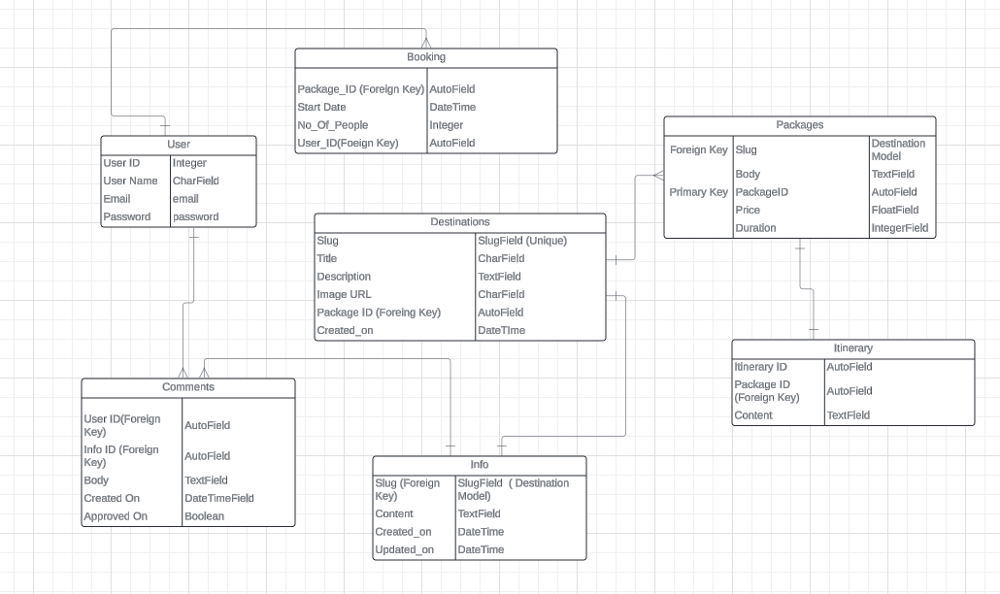

# Travel Era 
  This travel web site aiming to develop for Full Stack Software Development bootcamp final project at Code Institute.

  The site purpose is to embrace families and individuals who love to make effortless travel around Sound East Asia region.
Any user who didn't register can be able to see all types of tour packages and prices for each destinations shown . However, in order to request the itinerary or comments / review on the posts they will need to register and log in.

### Outline key features  

 * Destinations
 * Tour Packages
 * Manage Booking Reservation
 * Registration/ Account Management
 * Comments CRUD on Destinations Info Post

  > ## Target Audiences
  Adventure Seekers , Cultural Enthusiasts – Tourists interested in exploring historical sites, traditional festivals, local customs, and UNESCO World Heritage locations.

  Luxury Travelers – High-end tourists seeking premium, customized experiences including exclusive resorts, private tours, and personalized service.

  Families & Groups – Families or groups of friends who want stress-free
  , well-organized vacations that cater to all age groups, with itineraries that balance adventure, culture, and relaxation.

  Digital Nomads – Remote workers looking to combine travel with work, interested in exploring Southeast Asia’s growing coworking spaces, long-term stay options, and vibrant urban hubs.
     

       Introduction](#Travel Era---introduction)
  - [User Experience - UX](#user-experience---ux)
    - [Site Aims](#site-aims)
    - [Agile Methodology](#agile-methodology)
      - [Epics and User Stories](#epics-and-user-stories)
      - [Tasks](#tasks)
  - [Design](#design)
    - [Colours](#colours)
    - [Typography](#typography)
    - [Imagery](#imagery)
    - [Wireframes](#wireframes)
  - [Database Diagram](#database-diagram)
  - [Features](#features)
    - [Home Page](#home-page)
      - [Navbar](#navbar)
      - [Hero Image](#hero-image)
      - [Destination Section](#destination-section)
      - [Footer](#footer)
    - [User Page](#user-page)
    - [About Page](#about-page)
    - [Blog Page](#blog-page)
      - [Blog Details](#blog-details)
      - [Blog Comments](#blog-comments)
    - [Register](#register)
    - [Login](#login)
    - [Logout](#logout)
    - [Destinations](#destinations)
    - [Alert Messages](#alert-messages)      
  - [Admin Panel/Superuser](#admin-panelsuperuser)
  - [Technologies Used](#technologies-used)
    - [Languages Used](#languages-used)
    - [Django Packages](#django-packages)
    - [Frameworks - Libraries - Programs Used](#frameworks---libraries---programs-used)
  - [Testing](#testing)
      - [Validation](#validation)
      - [Manual Testing](#manual-testing)
  - [Bugs](#bugs)
      - [Fixed Bugs](#fixed-bugs)
      - [Unfix Bugs](#unfix-bugs)
  - [Deployment](#deployment)
      - [Creating the Django project](#creating-the-django-project)
      - [Creating Heroku app](#creating-heroku-app)
      - [Set up Environment Variables](#set-up-environment-variables)
      - [Heroku deployment](#heroku-deployment)
      - [Final Deployment](#final-deployment)
  - [Credits](#credits)
    - [Content](#content)
    - [Information Sources / Resources](#information-sources--resources)
  - [Acknowledgement](#acknowledgement)

  # User Experience - UX

## Site Aims

*
## Agile Methodology

The Agile Methodology was used to plan this project. This was implemented through Github and the Project Board. 

Please find my Kanban Board with my user stories [here]

## Epics and User Stories

### Epics : User Registration
 Goals : 
 * Landing page should be easy access for the user to register, able to Log In and Log Out. 
 * Registered users will be given the access to comment CRUD features . 

#### Related User Stories:
* As a new user of site I want to create a user account by using my email and password
So that I can access all the functionality of the site.
- AC - There will be a button for registration on the Nav bar

## Tasks

The tasks for the website development process was closely followed as mentioned in CI's Django module "I Think Therefore I Blog" walkthrough project. 

**Before Project Inception**

**Creation of Project in GitPod**

-

-----

## Design

### Colours

### Typography

### Imagery

----
### Wireframes

----

## Database Diagram

Lucidchart was used to create a database schema to visualise the types of custom models the project requires. Below is the Database structure that this project is based on. 

----

# UI Features

### Home:
 A button or link that brings the user to the homepage.

### Destination Cards: 
Different travel destination cards, each offering:
    A placeholder image representing the destination.
    A brief description of the destination.
    "Our Packages" Button: Leads to detailed package offers for the specific destination.
    "Info" Button: Provides more detailed information about the destination.

### Our Packages: 
Links to a page displaying travel packages or details of available destinations.

My Booking: Provides access to a user’s current bookings or reservation history.

Log In / Register: A login or registration page to access user accounts.
Main Section (Travel Destinations):

### More Info :
Links to a page displaying more information i.e Things to do , Local Food , Culture about each destination which feature can give user to research more about the destination they want to explore.

### Footer Section:

Rating: Shows customer ratings for the overall travel services or destinations.

Reviews: Displays customer reviews or testimonials.
Social Media Icons: Links to social media pages for further interaction with the service.

----

### Sign Up

- 

### Sign In

-

### Sign Out

- 

----

## Admin Panel/Superuser

-

### Admin 'Post' Model Management

- 

### Admin 'Comment' Model Management

- U

### Admin 'Destination' Model Management

----

## Technologies Used

### Languages Used

### Frameworks - Libraries - Programs Used

* [Django](https://www.djangoproject.com/) 

-----

[Back to top ⇧](#content)

## Testing

### Validation

- HTML using [W3C HTML validator](https://validator.w3.org/)
- CSS using [Jigsaw CSS validator](https://jigsaw.w3.org/css-validator/)
- Python via [PEP8 CI Python Linter](https://pep8ci.herokuapp.com/)

### Manual Testing

----

## Bugs

| **Bug** | **Fix** |
| ----------- | ----------- |
|

| **Unfix Bug** |
| ----------- | 

----

## Future Implementation

[Back to top ⇧](#content)

## Deployment

### 1. Creating the Django Project
* Go to the Code Institute Gitpod Full Template [Template](https://github.com/Code-Institute-Org/gitpod-full-template).
* 

### 2. Create your Heroku app
* Navigate to [Heroku](https://id.heroku.com).
* 

### 5. Heroku Deployment: 
* Click Deploy tab in Heroku.

* Select Github as the deployment method.

* Confirm you want to connect to GitHub.

* Search for the repository name and click the connect button to link the heroku app with the Github repository. The box will confirm that heroku is connected to the repository.

* Scroll to the bottom of the deploy page and select the preferred deployment type.

* Click either Enable Automatic Deploys for automatic deployment when you push updates to Github or To manually deploy click the button 'Deploy Branch'. The default 'main' option in the dropdown menu should be selected in both cases. When the app is deployed a message 'Your app was successfully deployed' will be shown. Click 'view' to see the deployed app in the browser.

### 6. Final Deployment
In the IDE:
* When development is complete change the debug setting to: `DEBUG = False` in `settings.py` 
* In Heroku settings config vars change the `DISABLE_COLLECTSTATIC` value to 0
* Because DEBUG must be switched to True for development and False for production it is recommended that only manual deployment is used in Heroku. 

* To manually deploy click the button 'Deploy Branch'. The default 'main' option in the dropdown menu should be selected in both cases. When the app is deployed a message 'Your app was successfully deployed' will be shown. Click 'view' to see the deployed app in the browser.

----

# Credits

## Code
- 

## Learning Resources

## Content and Media

----

## Acknowledgement

