# Travel Era 
  This travel web site aiming to develop for Full Stack Software Development bootcamp final project at Code Institute.

  

### Outline key features  

 * Destinations

 * Tour Packages

 * Manage Booking Reservation (User can edit and delete bookings from booking history CRUD)

 * Registration/ Account Management

 * Comments CRUD on Destinations Info Post

  > ## Target Audiences
  Adventure Seekers , Cultural Enthusiasts – Tourists interested in exploring historical sites, traditional festivals, local customs, and UNESCO World Heritage locations.

  Luxury Travelers – High-end tourists seeking premium, customized experiences including exclusive resorts, private tours, and personalized service.

  Families & Groups – Families or groups of friends who want stress-free
  , well-organized vacations that cater to all age groups, with itineraries that balance adventure, culture, and relaxation.

  Digital Nomads – Remote workers looking to combine travel with work, interested in exploring Southeast Asia’s growing coworking spaces, long-term stay options, and vibrant urban hubs.
     
     Table of Contents 
  - [User Experience - UX](#user-experience---ux)
    - [Site Aims](#site-aims)
    - [Agile Methodology](#agile-methodology)
      - [Epics and User Stories](#epics-and-user-stories)
      - [Tasks](#tasks)
  - [Design](#design)
    - [Colours](#colours)
    - [Typography](#typography)
    - [Imagery](#imagery)
    - [Wireframes](#wireframes)
  - [Database Diagram](#database-diagram)
  - [Features](#features)      

  - [Admin Panel/Superuser](#admin-panelsuperuser)
  - [Technologies Used](#technologies-used)
    - [Languages Used](#languages-used)
    - [Django Packages](#django-packages)
    - [Frameworks - Libraries - Programs Used](#frameworks---libraries---programs-used)
    
  - [Testing](#testing)
      - [Validation](#validation)
      - [Manual Testing](#manual-testing)
  - [Bugs](#bugs)
      - [Fixed Bugs](#fixed-bugs)
      - [Unfix Bugs](#unfix-bugs)
  - [Deployment](#deployment)
      - [Creating the Django project](#creating-the-django-project)
      - [Creating Heroku app](#creating-heroku-app)
      - [Set up Environment Variables](#set-up-environment-variables)
      - [Heroku deployment](#heroku-deployment)
      - [Final Deployment](#final-deployment)
  - [Credits](#credits)
    - [Content](#content)
    - [Information Sources / Resources](#information-sources--resources)
  - [Acknowledgement](#acknowledgement)

  # User Experience - UX

## Site Aims

  The site purpose is to embrace families and individuals who love to make effortless travel around Sound East Asia region.

  Any user who didn't register can be able to see all types of tour packages and prices for each destinations shown as well as requesting the booking for the specific packages. 
  
  However, in order to request the booking for desired package and adding the comments on the destination info page they will need to be registered.

## Agile Methodology

The Agile Methodology was used to plan this project. This was implemented through Github and the Project Board. 

Please find my Kanban Board with my user stories [https://github.com/users/eshwes01/projects/4]

## Epics and User Stories

### Epics : User Registration
 Goals : 
 * Landing page should be easy access for the user to register, able to Log In and Log Out. 
 * Registered users will be given the access to comment CRUD features . 

#### Related User Stories:
 As a new user of site I want to create a user account by using my email and password
  So that I can access all the functionality of the site.

  Acceptance Criteria
- AC - There will be a clearly defined button for registration on the Nav bar for Log in and Log out.

### User Story 2 View paginated list of the destinations

As a site user I can see all available list of destinations in one page.
So that I can visit to each available destination which site has to offer.

  Acceptance Criteria
- AC . When user click on destinations button on the Nav bar it will show the list of destinations from the database.

### User Story-3 View Packages

As a site user I can see all available packages that the site has to offer for given destination
So that I can choose suitable package for given destination. 

Acceptance Criteria
- A.C : For each destination user will be given the list of available packages in the "package detail" page to see all the details of the package including duration and prices of each package.
- A.C : User will be also given access to get to the Itinerary and Booking in every package section. 

### User Story-4 Request Booking

As a registered user , I can request the booking of the tour packages by providing booking month and number of people for the desired package
So that the site admin can see my request and respond to the request by giving all the necessary information to proceed the confirmation.

Acceptance Criteria

- AC : User can request booking via the form given within itinerary detail page
- AC : User must Log In to make the booking request.
- AC : All the fields will be required to fill by the user .
- AC : User will be given the notification once they submitted.

### User Story-5 Destination Info

As a user I can view more information about the specific destinations of my choice
So that I can research more about the destination

Acceptance Criteria
- AC : Under each destination user can see the Info button which take them to the more info page.

### User Story-6 My Booking Page

As an registered user I can go to the "My Booking" link
So that can see all the booking history that I made.

Acceptance Criteria
- AC : My Booking link will be displayed on the Nav bar easily reachable in any pages of the site
- AC : User must Log In to see the list of the Booking reservation.

### User Story-7 Comment in the Info Page
As a site user I can comment on the post of "More Info" page offered by each destination
So that I can ask more questions/ tips about anything that I need to know before the tour.

Acceptance Criteria

- AC : User must Log In to comment on the "More Info" post .
- AC : All Users both registered or non-registered users can see all the comments which has been shown.
- AC : Only registered users can be able to Update or Delete Comments.

### User Story-8 Edit Comments

As a registered user I can EDIT of the previous comments

Acceptance Criteria
- AC : User can find the edit button on the comments that given
- AC: User must be Logged In before editing the comments
- AC: User can only edit his/her comments .

### User Story-9 Delete Comments
As a registered user I can DELETE of my previous unwanted comments

Acceptance Criteria
- AC : User can find the DELETE button on the comments that given
- AC: User must be Logged In before deleting the comments
- AC: User can only delete his/her comments .

### User Story-10  Modifying / Deleting the Booking request
As a registered user I can EDIT / DELETE the booking request I made.

Acceptance Criteria
- AC : User can find the Edit / Delete button right under each booking request he made on My Booking page.
- AC : User must logged In before editing / deleting the requests.

## Tasks

The tasks for the website development process was closely followed as mentioned in CI's Django module "I Think Therefore I Blog" walkthrough project. 

## Design

### Colours

### Typography

### Imagery

----
### Wireframes

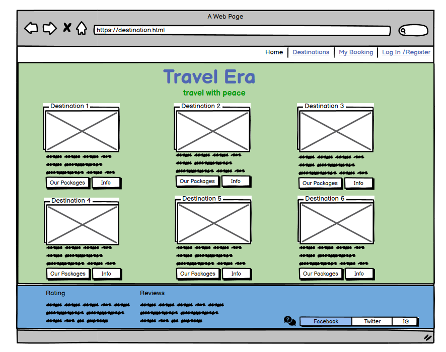
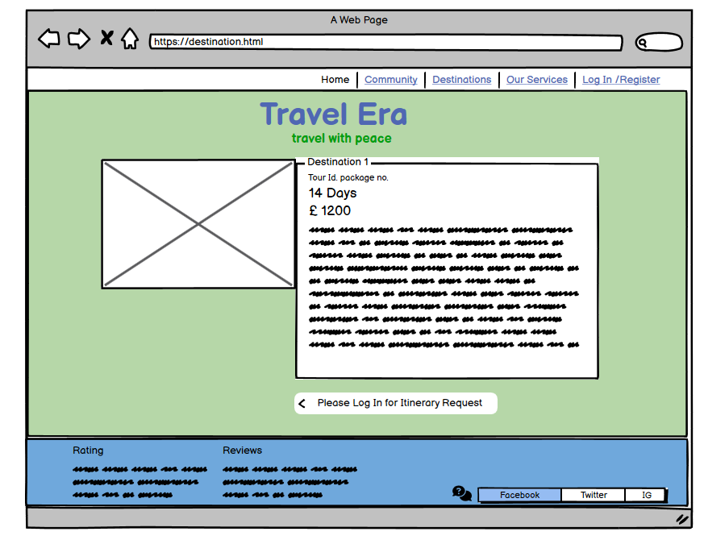
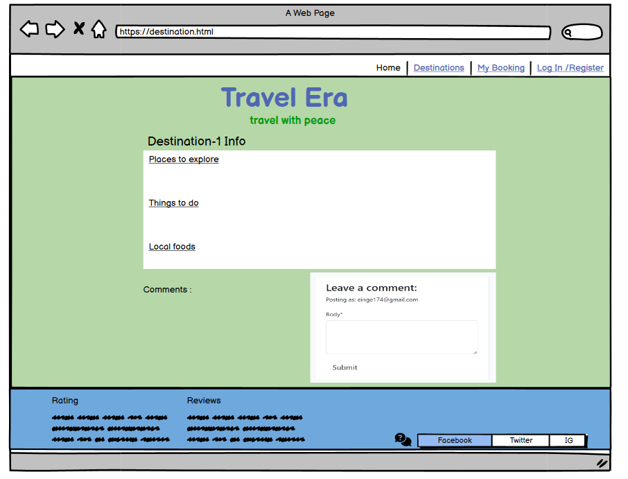
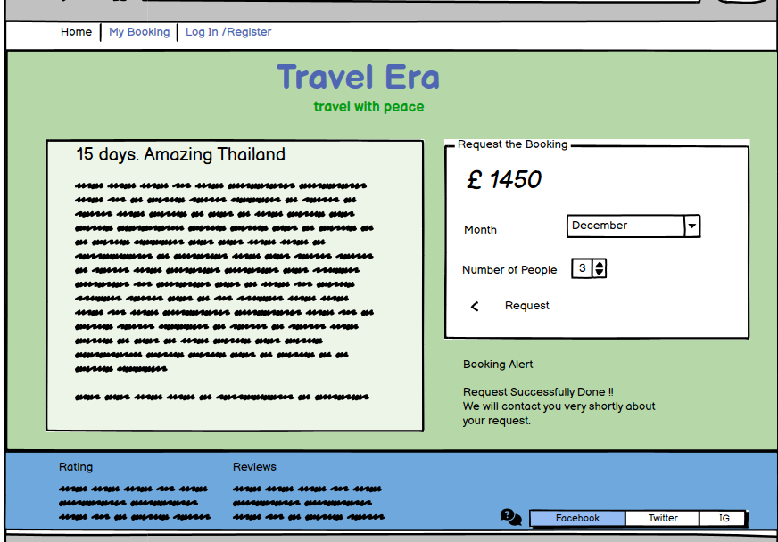
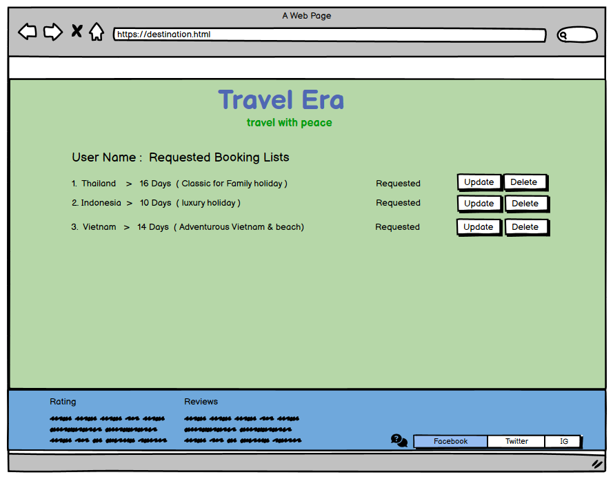

----

## Database Diagram

Lucidchart was used to create a database schema to visualise the types of custom models the project requires. Below is the Database structure that this project is based on. 

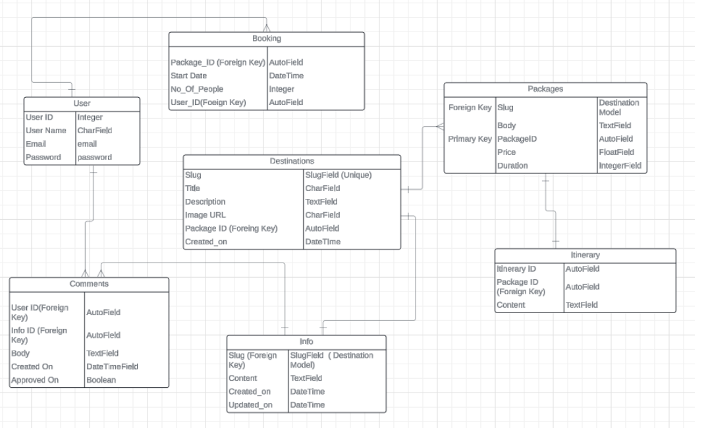

----
# Features
# UI Features

## Home:
 A button or link that brings the user to the homepage.

## Destination Cards: 
Different travel destination cards, each offering:
    A placeholder image representing the destination.
    A brief description of the destination.
    "Our Packages" Button: Leads to detailed package offers for the specific destination.
    "Info" Button: Provides more detailed information about the destination.

## Our Packages: 
Links to a page displaying travel packages or details of available destinations.

My Booking: Provides access to a user’s current bookings or reservation history.
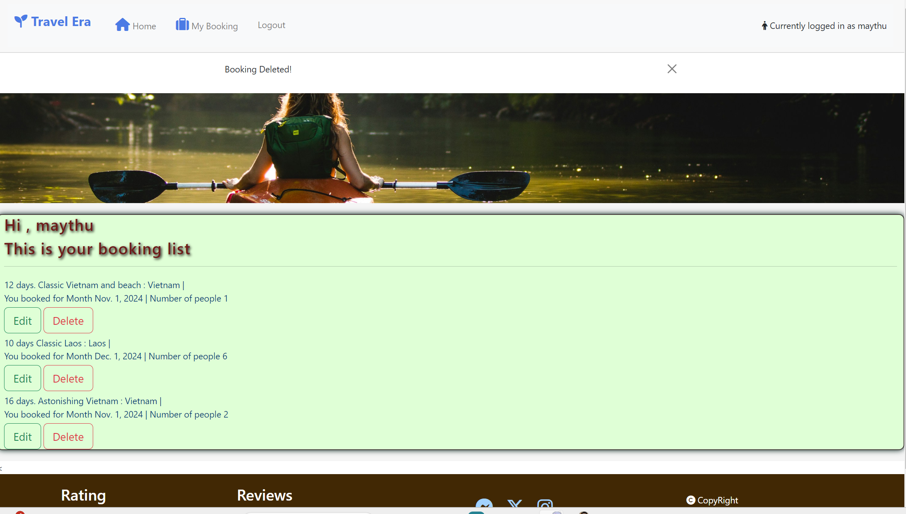

Log In / Register: A login or registration page to access user accounts.
Main Section (Travel Destinations):

## More Info :
Links to a page displaying more information i.e Things to do , Local Food , Culture about each destination which feature can give user to research more about the destination they want to explore.

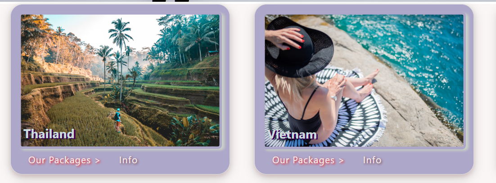

### Itinerary Details & Booking

Itinerary deatils link can be seen when user click "Our package" in landing page as below 
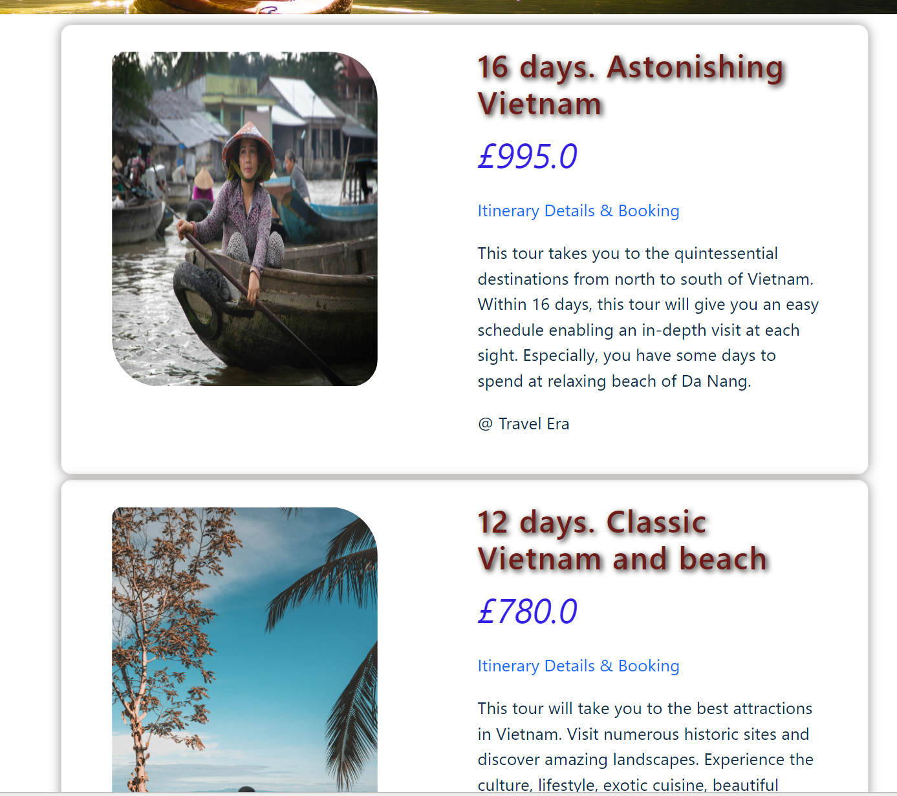

### My Booking
Booking Details: Below the greeting, each booking is listed with relevant information such as:
Trip Description: For each trip, details such as the number of days (e.g., "12 days, Classic Vietnam and beach"), the destination (e.g., "Vietnam"), 
and the booking month (e.g., "You booked for Month Nov. 1, 2024") are displayed.
Number of People: It also mentions how many people are included in the booking (e.g., "Number of people: 1").

### Edit Booking 

User allow to edit the booking that they made whether or not confirm by one of the advisors. 

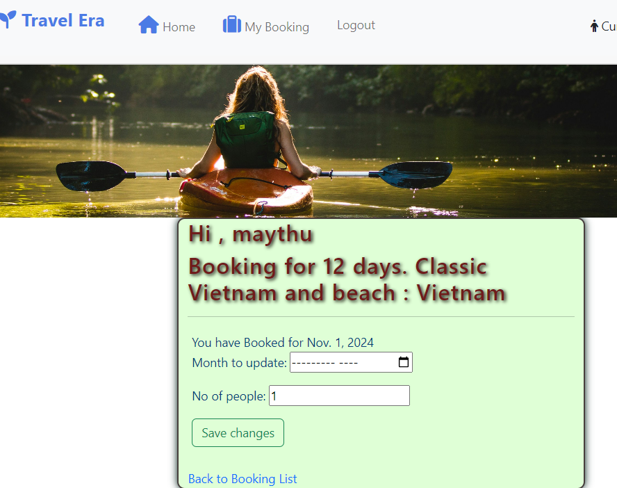

###  Delete Booking

User can be able to delete the booking that they made whether or not confirm by one of the advisors.

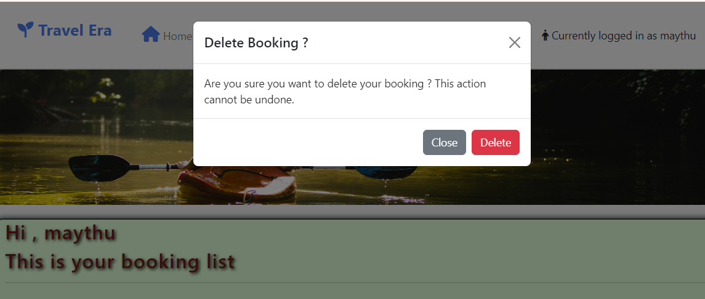

### Footer Section:

Rating: Shows customer ratings for the overall travel services or destinations.

Reviews: Displays customer reviews or testimonials.
Social Media Icons: Links to social media pages for further interaction with the service.

----

### Sign Up

- 

### Sign In

-

### Sign Out

- 

----

## Admin Panel/Superuser

-

### Admin 'Post' Model Management

- 

### Admin 'Comment' Model Management

- 

### Admin 'Destination' Model Management

----

## Technologies Used

### Languages Used

### Frameworks - Libraries - Programs Used

* [Django](https://www.djangoproject.com/) 

-----

[Back to top ⇧](#content)

## Testing

### Validation

- HTML using [W3C HTML validator](https://validator.w3.org/)
- CSS using [Jigsaw CSS validator](https://jigsaw.w3.org/css-validator/)
- Python via [PEP8 CI Python Linter](https://pep8ci.herokuapp.com/)

### Manual Testing

----

## Bugs

| **Bug** | **Fix** |
| ----------- | ----------- |
|

| **Unfix Bug** |
| ----------- | 

----

## Future Implementation

## Deployment

### 1. Creating the Django Project
* Go to the Code Institute Gitpod Full Template [Template](https://github.com/Code-Institute-Org/gitpod-full-template).
* 

### 2. Create your Heroku app
* Navigate to [Heroku](https://id.heroku.com).
* 

### 5. Heroku Deployment: 
* Click Deploy tab in Heroku.

* Select Github as the deployment method.

* Confirm you want to connect to GitHub.

* Search for the repository name and click the connect button to link the heroku app with the Github repository. The box will confirm that heroku is connected to the repository.

* Scroll to the bottom of the deploy page and select the preferred deployment type.

* Click either Enable Automatic Deploys for automatic deployment when you push updates to Github or To manually deploy click the button 'Deploy Branch'. The default 'main' option in the dropdown menu should be selected in both cases. When the app is deployed a message 'Your app was successfully deployed' will be shown. Click 'view' to see the deployed app in the browser.

### 6. Final Deployment
In the IDE:
* When development is complete change the debug setting to: `DEBUG = False` in `settings.py` 
* In Heroku settings config vars change the `DISABLE_COLLECTSTATIC` value to 0
* Because DEBUG must be switched to True for development and False for production it is recommended that only manual deployment is used in Heroku. 

* To manually deploy click the button 'Deploy Branch'. The default 'main' option in the dropdown menu should be selected in both cases. When the app is deployed a message 'Your app was successfully deployed' will be shown. Click 'view' to see the deployed app in the browser.

----

# Credits

## Code
- 

## Learning Resources

## Content and Media

## Important Notice 

  During development SECRET KEY in setting has been committed to GitHub unintentionally . However , the key has already taken out and securely added in the env.py file.

----

## Acknowledgement

