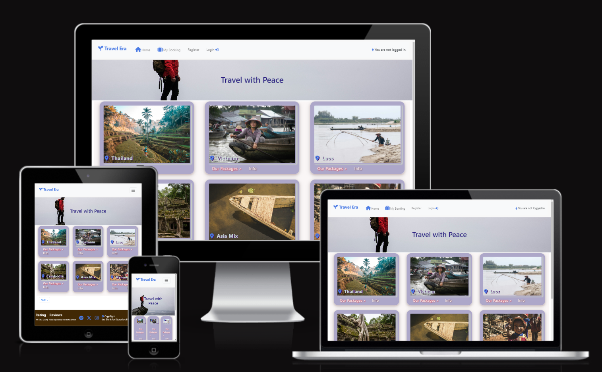
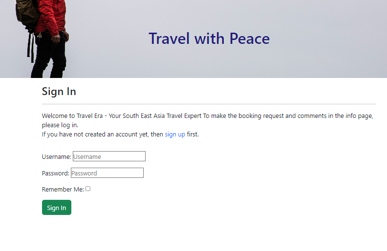
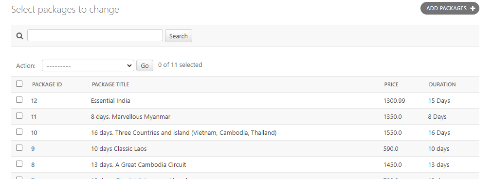
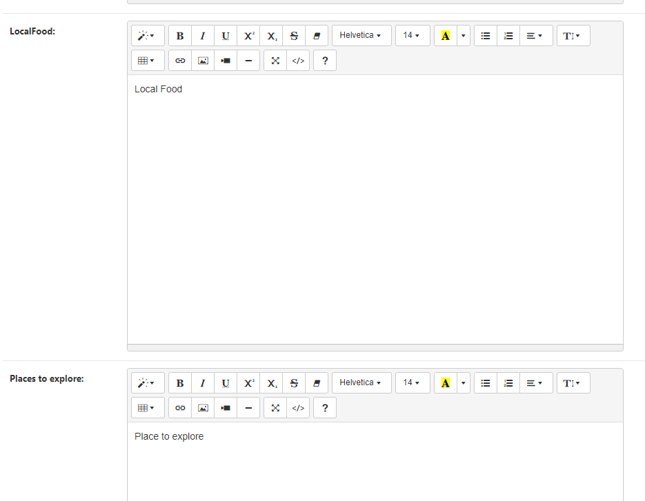
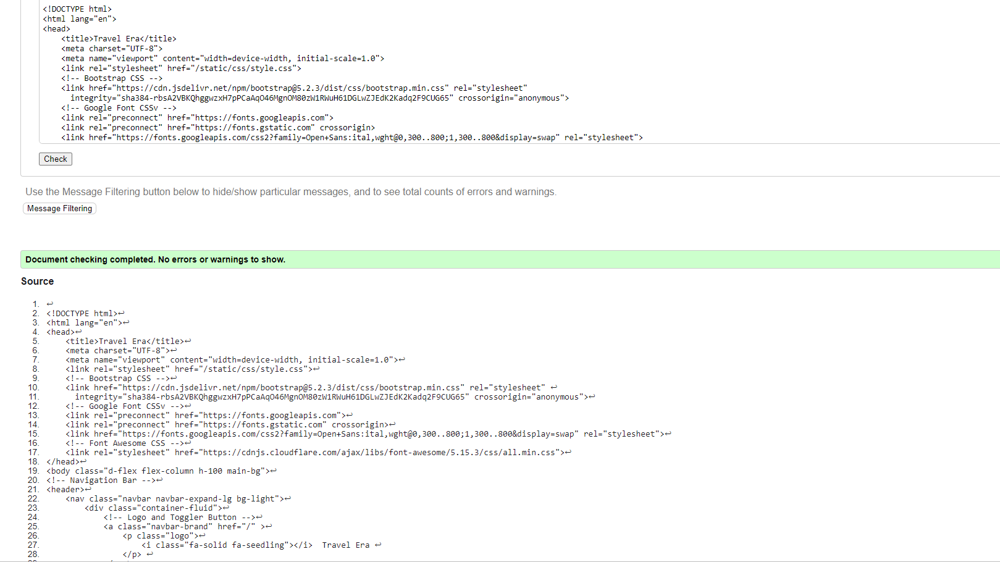
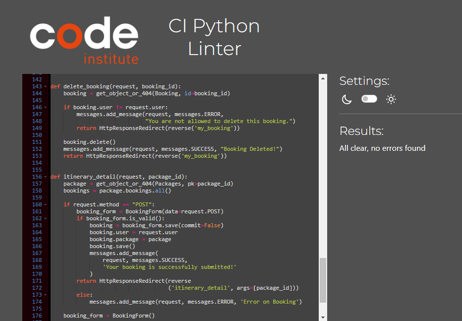

# Travel Era 
  This travel site is aiming to develop for Full Stack Software Development bootcamp final CATSTONE project at Code Institute.

  

 Deployed version of this site can access here : https://simple-app-52d1ea9641cb.herokuapp.com/

### Outline key features  

Site user can do following features ,
 
 * Booking Request 

 * Manage Booking Reservation 
      (User can edit and delete bookings from booking history CRUD)

 * Registration/ Account Management

 * Comments on Destinations Info posts
      (User can create,edit and delete the comments CRUD )

 Admin (Super) user of the site can add , 
   * Destinations 
   * Tour Packages 
   * Precise Itinerary details 
   * Create Post about "Info" in the admin panel to display for the users in order to expand more on their research of the tours.

  > ## Target Audiences  :  

  Adventure Seekers , Cultural Enthusiasts – Tourists interested in exploring historical sites, traditional festivals, local customs, and UNESCO World Heritage locations.

  Luxury Travelers – High-end tourists seeking premium, customized experiences including exclusive resorts, private tours, and personalized service.

  Families & Groups – Families or groups of friends who want stress-free
  , well-organized vacations that cater to all age groups, with itineraries that balance adventure, culture, and relaxation.

  Digital Nomads – Remote workers looking to combine travel with work, interested in exploring Southeast Asia’s growing coworking spaces, long-term stay options, and vibrant urban hubs.
     
     Table of Contents 
  - [User Experience - UX](#user-experience---ux)
    - [Site Aims](#site-aims)
    - [Agile Methodology](#agile-methodology)
      - [Epics and User Stories](#epics-and-user-stories)
      - [Tasks](#tasks)
  - [Design](#design)
    - [Colours](#colours)
    - [Typography](#typography)
    - [Imagery](#imagery)
    - [Wireframes](#wireframes)
  - [Database Diagram](#database-diagram)
  - [Features](#features)      

  - [Admin Panel/Superuser](#admin-panelsuperuser)
  - [Technologies Used](#technologies-used)
    - [Languages Used](#languages-used)
    - [Django Packages](#django-packages)
    - [Frameworks - Libraries - Programs Used](#frameworks---libraries---programs-used)
    
  - [Testing](#testing)
      - [Validation](#validation)
      - [Manual Testing](#manual-testing)
  - [Bugs](#bugs)
      - [Fixed Bugs](#fixed-bugs)
      - [Unfix Bugs](#unfix-bugs)
  - [Deployment](#deployment)
      - [Creating the Django project](#creating-the-django-project)
   
  - [Credits](#credits)
    - [Content](#content)
    - [Information Sources / Resources](#information-sources--resources)
  - [Acknowledgement](#acknowledgement)

  # User Experience - UX

## Site Aims

  The site purpose is to embrace families and individuals who love to make effortless travel around Sound East Asia region. 
  Giving more flexibilty and variety of destinations regarding the tour packages. 
  
  Travellers were encouraged to do more research about the places to explore by offering info call out button on landing page and allowing users to dive deeper into travel packages and details for each destination.

  
## Agile Methodology

The Agile Methodology was used to plan this project. This was implemented through Github and the Project Board. All the acceptance criteria has been tested as each story before the 'Done' stage and were also included in the final pre-submission manual testing documented .

Please find my Kanban Board with my user stories here:  [https://github.com/users/eshwes01/projects/4]

## Epics and User Stories
### Epics : User Registration
 Goals : 
 * Landing page should be easy access for the user to register, able to Log In and Log Out. 
 * Registered users will be given the access to comment CRUD features . 

### User Story 1 :
 As a new user of site I want to create a user account by using my email and password
  So that I can access all the functionality of the site.

  Acceptance Criteria
- AC - There will be a clearly defined button for registration on the Nav bar for Log in and Log out.

### User Story 2 View paginated list of the destinations

As a site user I can see all available list of destinations in one page.
So that I can visit to each available destination which site has to offer.

  Acceptance Criteria
- AC . When user click on destinations button on the Nav bar it will show the list of destinations from the database.

### User Story-3 View Packages

As a site user I can see all available packages that the site has to offer for given destination
So that I can choose suitable package for given destination. 

Acceptance Criteria
- A.C : For each destination user will be given the list of available packages in the "package detail" page to see all the details of the package including duration and prices of each package.
- A.C : User will be also given access to get to the Itinerary and Booking in every package section. 

### User Story-4 Request Booking

As a registered user , I can request the booking of the tour packages by providing booking month and number of people for the desired package
So that the site admin can see my request and respond to the request by giving all the necessary information to proceed the confirmation.

Acceptance Criteria

- AC : User can request booking via the form given within itinerary detail page
- AC : User must Log In to make the booking request.
- AC : All the fields will be required to fill by the user .
- AC : User will be given the notification once they submitted.

### User Story-5 Destination Info

As a user I can view more information about the specific destinations of my choice
So that I can research more about the destination

Acceptance Criteria
- AC : Under each destination user can see the Info button which take them to the more info page.

### User Story-6 My Booking Page

As an registered user I can go to the "My Booking" link
So that can see all the booking history that I made.

Acceptance Criteria
- AC : My Booking link will be displayed on the Nav bar easily reachable in any pages of the site
- AC : User must Log In to see the list of the Booking reservation.

### User Story-7 Comment in the Info Page
As a site user I can comment on the post of "More Info" page offered by each destination
So that I can ask more questions/ tips about anything that I need to know before the tour.

Acceptance Criteria

- AC : User must Log In to comment on the "More Info" post .
- AC : All Users both registered or non-registered users can see all the comments which has been shown.
- AC : Only registered users can be able to Update or Delete Comments.

### User Story-8 Edit Comments

As a registered user I can EDIT of the previous comments

Acceptance Criteria
- AC : User can find the edit button on the comments that given
- AC: User must be Logged In before editing the comments
- AC: User can only edit his/her comments .

### User Story-9 Delete Comments
As a registered user I can DELETE of my previous unwanted comments

Acceptance Criteria
- AC : User can find the DELETE button on the comments that given
- AC: User must be Logged In before deleting the comments
- AC: User can only delete his/her comments .

### User Story-10  Modifying / Deleting the Booking request
As a registered user I can EDIT / DELETE the booking request I made.

Acceptance Criteria
- AC : User can find the Edit / Delete button right under each booking request he made on My Booking page.
- AC : User must logged In before editing / deleting the requests.

### User Story-11 Create Destination
As a site admin I can create ,edit and delete the destinations
So that I can manage the destinations availability

Acceptance Criteria
- AC : All available destination can be seen by users as soon as they land the page.
- AC : Destinations will be display by card display with pagination of 3 columns and 2 rows easy to navigate .

### User Story-12 Create New Packages
As a site admin I can create , edit and delete the packages of specific each destination
So that I can manage all the necessary contents and their availability .

### User Story-13 Create Info Post

As a site admin , I can be able to manage the info post for related destinations
So that I can update and delete the relevant and up-to-date information for the users.

Acceptance Criteria
-AC : One destination will have one info page where user can see all further information and can comment on post.

### User Story-14 Comment Approval from admin site

As a site admin I can see all the comments that user make in the admin panel
So that I can monitor and approve relevant comments associated with the post.

Acceptance Criteria
- AC : All the comments awaiting for admin approval will be on hold to the admin site and users can only see once approved.
- AC : Site user will be notified for with awaiting for approval message once submitted comment.
- AC : Approved comments can be seen by all visitors of the site but only authenticated user can edit /delete

## Tasks

The tasks for the website development processes were closely followed as mentioned in CI's Django module "I Think Therefore I Blog" walkthrough project.
Project idea is mainly inspired from the tour package travel providers site and former CI's students projects .

## Design
Page Layout: The page uses a minimalistic, card-based layout that is easy to navigate, especially on mobile devices.
Consistent Colors: The color palette of light purples and blues keeps the design professional yet welcoming.

Interactive Elements:
Info and Package Links: Each card includes interactive links (e.g., “Our Packages” and “Info”), allowing users to dive deeper into travel packages and details for each destination.
8. Mobile-Friendly Interface:
Collapsible Menu: The hamburger icon and stacked layout suggest the page is optimized for mobile users.

### Colours

Color Palette: The interface uses a clean and calm color palette with shades of green, brown, and white, reinforcing a nature or travel theme.

The site is design to be visually appealing with modern, rounded cards and a soft color scheme. The combination of purple card backgrounds and text gives it a calm, professional aesthetic.
It appears that the site is optimized for both mobile and desktop usage.

### Typography

 Google font  "Lato" has been used throughout the site with a backup of sans-seri for clear and simple readility.

### Imagery

    All travel images were taken from Unsplashed Photography website for which were given for frees access.

----
### Wireframes

Landing Page WF

Landing Page Mobile Screen

Package Detail Page WF

Info Detail Page WF

Itinerary Detail WF 

My Booking Page will look closer to this,

----

## Database Diagram

Lucidchart was used to create a database schema to visualise the types of custom models the project requires. Below is the Database structure that this project is based on. 

----
# Features
# UI Features

## Home and Logo
 A button or link that brings the user to the homepage.
  

### Destination Cards / Landing Page
  Different travel destination cards, each offering: A placeholder image representing the destination. 
  Calls to Action: "Our Packages" and "Info" links for more details on each destination, allowing users to explore available travel packages.

  

  
  

  ### F1. Our Package
  All users who come to visit the site can be able to see all types of "tour packages" and "prices" for each destinations shown .
  My Booking: Provides access to a user’s current bookings or reservation history.
  

  
  

 
  ### F2. Info" link from landing page 
  This link will take users to the page where more information about each specific destination from the site.
  

  ### F3 "Itinerary Detail and Booking" 
  Link can be seen on package detail page so that user can browse the itinerary details for each package and can request the booking. However, in order to request the booking for desired package and adding the comments on the destination info page they will need to be registered.

  Itinerary deatils link will be redirect when user click "Our package" call out button on landing page
  

  ### F4 Notification Messages -> 
  After users finished their bookings, notification messsage will be displayed on the top for booking succesfully submitted. 
  *** Booking Month and Number of people will be the required fields for users to make the booking. 

  

  ### F5 My Booking -> 
  Registered users who made booking for the site are allowed to update and delete their bookings by clicking the Edit / Delete button from My Booking page.

  Booking Details: Below the greeting, each booking is listed with relevant information such as:
  Trip Description: For each trip, details such as the number of days (e.g., "12 days, Classic Vietnam and beach"), the destination (e.g., "Vietnam"), 
  and the booking month (e.g., "You booked for Month Nov. 1, 2024") are displayed.
  Number of People: It also mentions how many people are included in the booking (e.g., "Number of people: 1").
  

### Edit Booking 

User allow to edit the booking that they made whether or not been confirmed by admin. 

Edit/Delete Buttons: For each booking, there are two action buttons:
Edit (green button): Allows the user to modify the booking.

###  Delete Booking

User can be able to delete the booking that they made whether or not been confirmed by admin.
Delete (red button): Provides an option to delete the booking.

  ### F6 Comment on Info Section -> 
  All Registered users can make comments on all the info section of each destinations, update and delete their comments whether the comments been approved by admin or not while non-registered users can only see all the comments but not allow to modify.  

### Footer Section:

Rating: Shows customer ratings for the overall travel services or destinations. (This is just for visual appealling display purpose.)

Reviews: Displays customer reviews or testimonials.
Social Media Icons: Links to social media pages for further interaction with the service.

Social Media Icons: There are icons linking to social media platforms such as Messenger, possibly Twitter (X), and Instagram, indicating that users can follow or contact the company through these platforms.

Copyright Statement
### Sign Up
  User has to sign up / register by providing their username and password .

### Sign In

In order to use site full functionality such as making booking request , or giving comments/suggestion users neeed to  Log In :

 
 

### Sign Out
 User can be able to sign out safely from the site.

 

----

## Admin Panel/Superuser
  
Admin (Super) user of the site can add ,

#### Destinations : 
Site admin can add/change the destination by clicking "Add+, Change" beside the Destinations on admin home page as below. 

 

 
 
#### Tour Packages : 
Site admin can add/change the tour packages by clicking "Add+" beside the Destinations on admin home page. Site admin can also see all existing packages. "Summer Note" field has been used in order to decorate or adding the image. 

 
 
 

#### Precise Itinerary details : 
Site admin can add/change the itinerary field in the packages table relavant to that speicific package. "Summer Note" field has been used in order to decorate the text.

### Admin 'Info'
Site admin can add/change the info in the Infos table,"Summer Note" field has been used in order to decorate the text.

### Admin 'Comment' Model Management
Site admin can see all the comments and approved  by using approved checkbox provided so that user can see their comments to be update or delete. Admin can delete the user comment if not appropiate for the site purpose. "Summer Note" field has been used in order to decorate the text.
-

### Admin 'Booking' Model Management
Site admin can see and delete all the bookings and adjust accordingly with the relavant availiable date to inform user back.

----

## Technologies Used

 *Gunicorn- As the server for Heroku.
* Cloudinary- Was used to host the static files and media for the site.
* Dj_database_url- To parse the database URL from the environment variables in Heroku.
* Psycopg2- As an adaptor for Python and PostgreSQL databases.

* Summernote- As a text editor.
* Allauth- For authentication, registration, account management.
* Crispy Forms- To style the forms.

### Languages Used

### Frameworks - Libraries

* [Django](https://www.djangoproject.com/) 
* Bootstrap- Used to style the website, add responsiveness and interactivity.
* Git- Used for version control by utilizing the Gitpod terminal to commit to Git and push to GitHub.
* GitHub- Used to store the project's code after being pushed from Git.

* PostgreSQL- Database used through heroku.
* Balsamiq- To build the wireframes for the project.
* Chrome Dev Tools was used to inspect page elements, debug, troubleshoot and test features and adjust property values. Using the Lighthouse extension installed in Chrome Browser, the performance report was generated.

* Font Awesome: was used to add icons for aesthetic and UX purposes.
* Heroku- Used to deploy the live project.

### Validation

### HTML using [W3C HTML validator](https://validator.w3.org/)

   
   Package Detail Page checked  

  Infor Page checked here 

  Edit Booking checked here 

 LogIn Page checked here

Log Out Page checked here

Found these errors when checking SingUp page however these code were from Django framework exisitng SignUp template.

 ### CSS using [Jigsaw CSS validator](https://jigsaw.w3.org/css-validator/)

   CSS styles checked passed.

### Python via [PEP8 CI Python Linter](https://pep8ci.herokuapp.com/)

Python views.py checked completed with No errors

Python models.py checked completed with No errors

Python forms.py checked completed with No errors

Python admin.py checked completed with No errors

 ### JSHint https://jshint.com/
While checking the JS code "Undefined Variable from bootstrap" has been shown as follow however the bootstrap has been imported in the base.html hence there has no issue on running the code.

 Commnet JS page checked 

 Booking JS page checked

## Testing

  Testing as been thoroughly done for all the functionality of the site which satisfied the user stories and outline features given with laptop and mobile devices. 

### Manual Testing

   Manual Test Plan can find here .
   

### Browser Compatibility

  Chrome DevTools was used to test the responsiveness of the application on different screen sizes. Further more testing from 
  * mobile devices such as  (Samsaung Note 10, Real Me pro 10 )
  * Safari Browser 
  were carried out for the full responsivness. 

--

## Bugs

| **Unfix Bug** |
| ----------- | 
   1. In the Edit Booking section of date field in the booking request has been validated with month instead of date [today.date().month ] therefore user can book previous date of this month. However user cannot book past months "Booking Error " will be shown. 

----

## Future Implementation

 1. Currently user couldn't make the enquiry about their booking status, this could be the future feature to add for next sprint.
 
 2. User canonot give the review for each packages this will be added to future implementation.

## Deployment

### 1.Creating the Django Project
* Go to the Code Institute Gitpod Full Template [Template](https://github.com/Code-Institute-Org/gitpod-full-template).

- App Installation and deploying this project with the help of this sheet below provided by Code Institute ,
  https://codeinstitute.s3.amazonaws.com/fst/Django%20Blog%20Cheat%20Sheet%20v1.pdf
*
### 2. Setting up settings.py
  In your Django 'settings.py' file type:
  from pathlib import Path
  import os
  import dj_database_url

  if os.path.isfile("env.py"):
  import env
  Remove the default insecure secret key in settings.py and replace with the link to the secret key variable in Heroku by typing: 
    SECRET_KEY = os.environ.get(SECRET_KEY)

### 3.Heroku Deployment: Heroku- Used to deploy the live project
.
* Click Deploy tab in Heroku.

* Select Github as the deployment method.

* Confirm you want to connect to GitHub.

* Search for the repository name and click the connect button to link the heroku app with the Github repository. The box will confirm that heroku is connected to the repository.

* Scroll to the bottom of the deploy page and select the preferred deployment type.

* Click either Enable Automatic Deploys for automatic deployment when you push updates to Github or To manually deploy click the button 'Deploy Branch'. The default 'main' option in the dropdown menu should be selected in both cases. When the app is deployed a message 'Your app was successfully deployed' will be shown. Click 'view' to see the deployed app in the browser.

###  Final Deployment
In the IDE:
* When development is complete change the debug setting to: `DEBUG = False` in `settings.py` 
* In Heroku settings config vars change the `DISABLE_COLLECTSTATIC` value to 0
* Because DEBUG must be switched to True for development and False for production it is recommended that only manual deployment is used in Heroku. 

* To manually deploy click the button 'Deploy Branch'. The default 'main' option in the dropdown menu should be selected in both cases. When the app is deployed a message 'Your app was successfully deployed' will be shown. Click 'view' to see the deployed app in the browser.

----

# Credits

## Code and Learning Resources
   
   Large amount of code used while developing this site were referenced and learned from following ,

  1. https://docs.djangoproject.com/en/5.1/ 
  2. https://stackoverflow.com/
  3. https://www.w3schools.com/
  4. Mdn Web docs
  5. Code Instite LMS contents (Therefor I Blog walkthrough)
  6. https://getbootstrap.com/docs/5.3/

## Content and Media
  Main Contents for destinations , packages and info pages were taken from the following web site and credit

   * https://www.titantravel.co.uk/blogs/
   * https://www.roughguides.com/
   * https://uniquetours.com/ 
   * https://www.indietraveller.co/things-to-do-in-bogota/
   * https://theadventurepeople.com/tour/ 

   Media Images were taken from 
    
https://unsplash.com/ 

    Credits goes to the following photographer artists of Unsplash site

    1. Neom 
    2. Pawel-janiak
    3. Tiago-rosado
    4. Vince
    5. Life on the road
    6. Himanshusingh-gurjar
    7. Daniel-lienert
    8. Diego-gennaro
    9. Jesse-schoff
    10. Julian-Yu-Wu

   Color Contrast for the whole site =>   https://coolors.co/palettes/trending

## Important Notice !!

  During development "SECRET KEY" in setting.py has been committed to GitHub unintentionally . However , the key has already taken out and securely placed in the env.py file.

----

## Acknowledgement

  My main appriciation and speicial thanks to my facilitator Elaine Roche, Mentor Mark Briscoe and John Rearden. All my fellow co-horts and tutor support. Chris for the best support througout the project. 
  
 